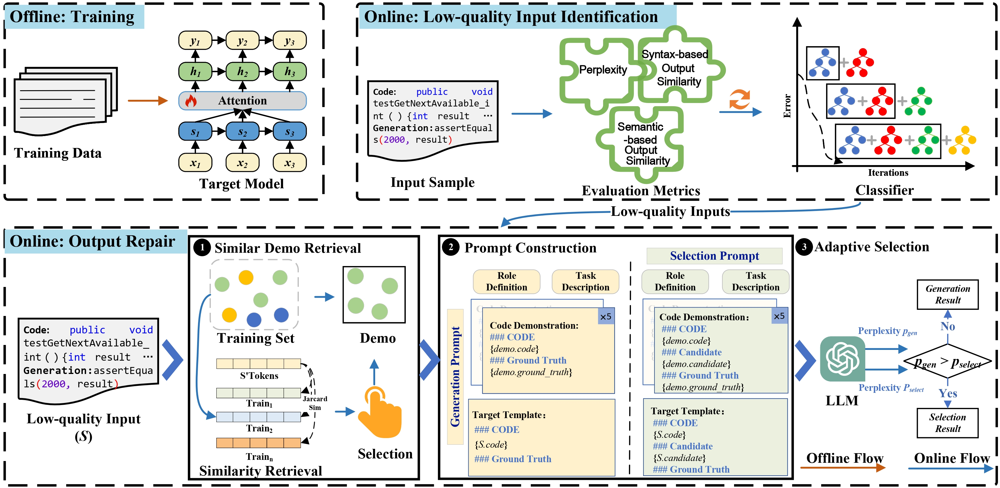

# On-the-fly Generation-Quality Enhancement of Deep Code Models via Model Collaboration （CodEn）

## ✨ Overview


## Directory Structure

The directory structure of this repository is shown as below:

```
.
|-- Dataset           # Dataset for training and validation
|-- outputs           # The final experimental results
|-- src	              # Scripts for all the experiments
    |-- *_ChatRepair_Ablation.py	           # The script of ablation experiments.
    |-- ATLAS_ChatRepair_parameter.py	       # The script of parameter analysis experiments.
    |-- *_ChatRepair_gpt.py	                   # The main function of CodEn with GPT
    |-- *_ChatRepair_osmodel.py	               # The main function of CodEn with open source model
    |-- *_ChatRepair_count.py	               # The script of experimental evaluation
    |-- *_ChatRepair_models.py	               # The custom class that support the execution of CodEn
    |-- *_ChatRepair_prompt_construction.py	               # The configuration file       
```

## 🔨 Setup environment
- Prerequisite:
  - Install [conda](https://docs.conda.io/projects/conda/en/4.6.1/user-guide/install/macos.html) package manager. 

- Create python environment with required dependencies (for example, `openai`). The concrete enviroment requirments are put in the `requirements.txt`.

- We have to compress large files in order to upload them to GitHub.
  - Please uncompress these files before running the code.
  - Uncompress all the datasets [file](https://drive.google.com/file/d/1ie3RL0e0LwcPquo27f4S8pEy7nIYnP7L/view?usp=drive_link) before running the code.
  - Uncompress all the pre-trained models (target model) [file](https://drive.google.com/file/d/13hFcT3KhCOmvOK4jHHYuSbmwPM6oALvH/view?usp=drive_link) before running the code.

We have construct the generation and selection prompts for all downstream tasks.
### Assertion Generation Task
```python
# Generation prompt:
sys_prompt = f"For the provided focal method '###Focal_method' and test prefix '###Test_prefix', generate the corresponding assertion, based on semantic and syntactic correctness.\nPut the generated assertion between <Repair> </Repair> tags.\nLet's think step by step!"

# Selection prompt:
sys_prompt = f"For the provided focal method '###Focal_method' and test prefix '###Test_prefix', identify the most appropriate assertion from the given list '###Assertions', based on semantic and syntactic correctness.\nPut the chosen assertion between <Repair> </Repair> tags.\nLet's think step by step!"
```

### Bug Fixing Task
```python
# Generation prompt:
sys_prompt = "Fix ESLint error in the following JavaScript code. Place your generated solution between <Repair> and </Repair> tags"

# Selection prompt:
sys_prompt = "Identyfy the correct fix from a set of proposed solutions labeled ###Fix_Code to fix ESLint error in the following JavaScript code. Place your chosen solution between <Repair> and </Repair> tags."
```

### Comment Summarization Task

```python
# Generation prompt:
sys_prompt = f"Assume you have a deep understanding of Java programming language concepts such as loops, conditionals, functions, and data structures.\nGiven a Java function '###Code', generate a short comment in one sentence.\nPlace your generated comment between <Repair> </Repair> tags.\nLet's think step by step!"

# Selection prompt:
sys_prompt = f"Given a Java function '###Code', analyze the function to understand its functionality and then select the most appropriate and concise comment from the given comment list '###Comments'.\nPut the chosen comment between <Repair> </Repair> tags.\nLet's think step by step!"
```

## 🚀 Running Experiment

Set OpenAI key:
```
To use the OpenAI API, you need to configure your API key in the `*_prompt_construction.py` file.
```

Run the following script, to run the experiments for `Assertion Generation`:
```
python ATLAS_ChatRepair_gpt.py
```

Run the following script, to run the experiments for `Bug Fixing`:
```
python NBF_ChatRepair_gpt.py
```

Run the following script, to run the experiments for `Comment Summarization`:
```
python Comment_ChatRepair_gpt.py
```

To run the experiments with the open source model, use the `*_osmodel.py`, and change the `model_name` in the `*_osmodel.py` file.

## 🚀 Running Evaluation

After running the experiments, repaired results are saved in the folder: `./outputs`.

Run the following script, to see the evaluation metrics.

```
python *_count.py to obtain the evaluation results of each downstream task.
```

## 🚀 Running Ablation Experiments

Run the following script, to see the ablation results.

```
python *_ChatRepair_Ablation.py to obtain the ablation results of each downstream task.
```
