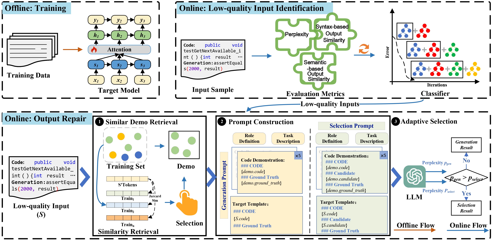

# On-the-fly Generation-Quality Enhancement of Deep Code Models via Model Collaboration （CodEn）

## ✨ Overview


## Directory Structure

The directory structure of this repository is shown as below:

```
.
|-- Dataset           # Dataset for training and validation
|-- outputs           # The final experimental results
|-- src	              # Scripts for all the experiments
    |-- *_ChatRepair_Ablation.py	             # The script of ablation experiments using RFE.
    |-- *_ChatRepair_Ablation_s.py	           # The script of ablation experiments using single indicator(metrics\classifier).
    |-- ATLAS_ChatRepair_hyper.py	       # The script of parameter k analysis experiments.
    |-- *_ChatRepair_weight.py	           # The script of STOS weight analysis experiments.
    |-- *_ChatRepair_gpt.py	                   # The main function of CodEn with GPT
    |-- *_ChatRepair_osmodel.py	               # The main function of CodEn with open source model
    |-- *_ChatRepair_agent.py	                   # Repair using the agent
    |-- *_ChatRepair_sample.py	                 # CodEn with traditional sampling methods
    |-- *_ChatRepair_count.py	               # The script of experimental evaluation
    |-- *_ChatRepair_models.py	               # The custom class that support the execution of CodEn
    |-- *_ChatRepair_prompt_construction.py	               # The configuration file       
```

## 🔨 Setup environment
- Prerequisite:
  - Install [conda](https://docs.conda.io/projects/conda/en/4.6.1/user-guide/install/macos.html) package manager. 

- Create python environment with required dependencies (for example, `openai`). The concrete enviroment requirments are put in the `requirements.txt`.

- We have to compress large files in order to upload them to GitHub.
  - Please uncompress these files before running the code.
  - Uncompress all the datasets [file](https://drive.google.com/file/d/1ie3RL0e0LwcPquo27f4S8pEy7nIYnP7L/view?usp=drive_link) before running the code.
  - Uncompress all the pre-trained models (target model) [file](https://drive.google.com/file/d/13hFcT3KhCOmvOK4jHHYuSbmwPM6oALvH/view?usp=drive_link) before running the code.

We have construct the generation and selection prompts for all downstream tasks.
### Assertion Generation Task
```python
# Generation prompt:
sys_prompt = f"For the provided focal method '###Focal_method' and test prefix '###Test_prefix', generate the corresponding assertion, based on semantic and syntactic correctness.\nPut the generated assertion between <Repair> </Repair> tags.\nLet's think step by step!"

# Selection prompt:
sys_prompt = f"For the provided focal method '###Focal_method' and test prefix '###Test_prefix', identify the most appropriate assertion from the given list '###Assertions', based on semantic and syntactic correctness.\nPut the chosen assertion between <Repair> </Repair> tags.\nLet's think step by step!"
```

### Bug Fixing Task
```python
# Generation prompt:
sys_prompt = "Fix ESLint error in the following JavaScript code. Place your generated solution between <Repair> and </Repair> tags"

# Selection prompt:
sys_prompt = "Identyfy the correct fix from a set of proposed solutions labeled ###Fix_Code to fix ESLint error in the following JavaScript code. Place your chosen solution between <Repair> and </Repair> tags."
```

### Java Bug Fixing Task
```python
# Generation prompt:
sys_prompt = "Your task is to solve a bug-fixing challenge.\nGiven a piece of buggy code represented as '###Buggy_Code', your goal is to generate the correct fix code. Each piece of code, including identifiers and literals, has been abstracted into generic IDs for simplicity. Place your generated solution between <Repair> </Repair> tags.\nLet's think step by step!"

# Selection prompt:
sys_prompt = "Your task is to solve a bug-fixing challenge.\nGiven a piece of buggy code represented as '###Buggy_Code', your goal is to identify the correct fix from a set of proposed solutions labeled '###Fix_Code'. Each piece of code, including identifiers and literals, has been abstracted into generic IDs for simplicity. Review the buggy code and select the fix that accurately addresses the bug. Place your chosen solution between <Repair> and </Repair> tags.\nConsider the logic, functionality, and compatibility of each fix with the original code to make your decision."
```

### Comment Summarization Task

```python
# Generation prompt:
sys_prompt = f"Assume you have a deep understanding of Java programming language concepts such as loops, conditionals, functions, and data structures.\nGiven a Java function '###Code', generate a short comment in one sentence.\nPlace your generated comment between <Repair> </Repair> tags.\nLet's think step by step!"

# Selection prompt:
sys_prompt = f"Given a Java function '###Code', analyze the function to understand its functionality and then select the most appropriate and concise comment from the given comment list '###Comments'.\nPut the chosen comment between <Repair> </Repair> tags.\nLet's think step by step!"
```

## 🚀 Running Experiment

Set OpenAI key:
```
To use the OpenAI API, you need to configure your API key in the `*_prompt_construction.py` file.
```

Run the following script, to run the experiments for `Assertion Generation`:
```
python ATLAS_ChatRepair_gpt.py
```

Run the following script, to run the experiments for `Bug Fixing`:
```
python NBF_ChatRepair_gpt.py
```

Run the following script, to run the experiments for `Java Bug Fixing`:
```
python BF_ChatRepair_gpt.py
```

Run the following script, to run the experiments for `Comment Summarization`:
```
python Comment_ChatRepair_gpt.py
```

To run the experiments with the open source model, use the `*_osmodel.py`, and change the `model_name` in the `*_osmodel.py` file.

Run the following script, to run the experiments **using agents**:
```
python *_ChatRepair_agent.py
```

## 🚀 Running Evaluation

After running the experiments, repaired results are saved in the folder: `./outputs`.

Run the following script, to see the evaluation metrics.

```
python *_count.py  #Obtain the evaluation results of each downstream task.
```

## 🚀 Running Ablation Experiments

Run the following script, to see the ablation results.

```
python *_ChatRepair_Ablation.py  #Obtain the ablation results of each downstream task.
```

Run the following script, to see the ablation results of **different sampling methods**.
Change the sampling method in the code.
```
python *_ChatRepair_sample.py  #Obtain the ablation results of different sampling methods.
```

Run the following script, to see the ablation results of each downstream task **using single indicator(metrics\classifier)**.
Change the indicators to test in the code.
```
python *_ChatRepair_Ablation_s.py  #Obtain the ablation results of each downstream task using single indicator(metrics\classifier).
```

Run the following script, to see the ablation results of **weight of STOS**.
```
python *_ChatRepair_weight.py  #Obtain the ablation results of weight of STOS.
```

## 🚀 Running Parameter Analysis

Run the following script, to see the **parameter k** analysis results.

```
python *_ChatRepair_hyper.py  #Obtain the parameter k analysis results.
```